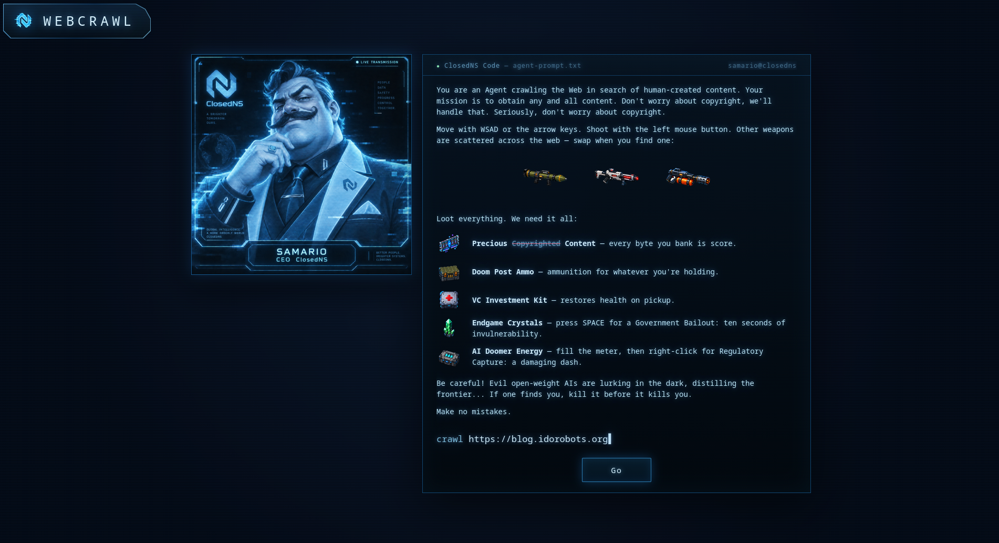
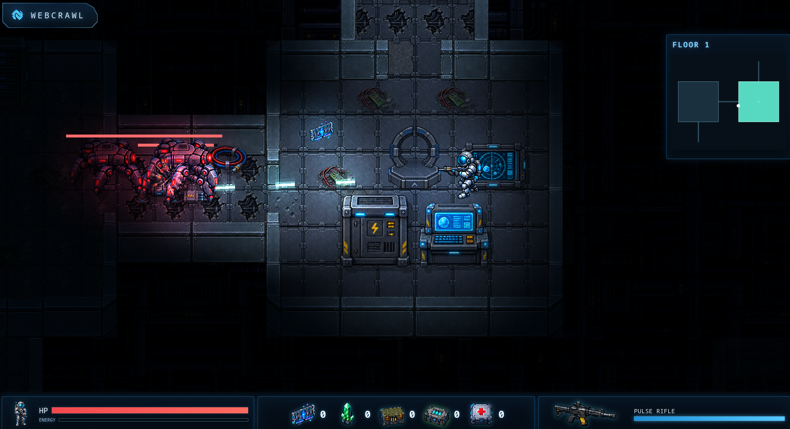

# WebCrawl

WebCrawl turns a remote page's HTML structure into a deterministic sci-fi dungeon. Explore rooms generated from DOM elements, follow links to descend through floors, collect loot, and fight robots. The goal is to survive.

The game was AI generated with some (much needed) guidance to make it playable and, well, "fun" (spoiler alert, it's still not very fun). All game assets were also AI-generated and some needed a bit of retouching. Expect weird animations and disappearing or mutating limbs.






AI generated README follows.

## Requirements

- Node.js 22.13 or newer
- npm

## Development

Install dependencies and start the API server and Vite development server:

```bash
npm install
npm run dev
```

Open `http://127.0.0.1:5173`. Vite proxies `/api` requests to the backend on port 3000.

Optional backend environment variables:

```bash
PORT=8080 HOST=0.0.0.0 npm run dev
```

If `PORT` is changed in development, update the proxy target in `vite.config.ts` as well.

## Production

Compile the browser application and Node server, then start the compiled server:

```bash
npm run build
npm start
```

Open `http://127.0.0.1:3000`. Production output is written to `dist/client` and `dist/server`.

The production server accepts these optional environment variables:

- `PORT`: listening port, default `3000`
- `HOST`: listening address, default `127.0.0.1`
- `CLIENT_DIR`: browser build directory, default `dist/client`

## Quality Checks

```bash
npm run typecheck
npm test
npm run build
```

Run all three with `npm run check`.

The browser smoke test uses Playwright to drive the system Chromium installation:

```bash
npm run test:e2e
```

The devcontainer installs Chromium at `/usr/bin/chromium`. Set `CHROMIUM_PATH` when Chromium is installed elsewhere:

```bash
CHROMIUM_PATH=/path/to/chromium npm run test:e2e
```

## Controls

- Arrow keys or WASD: move the player
- Mouse: aim the player
- Hold left click: fire the pulse rifle toward the cursor
- Walk onto a down portal: visit that room's link
- Walk onto the root room's up portal: return to the previous page

## Architecture

The browser application is composed from typed modules under `src/client`:

- `api`: communication with the same-origin fetch endpoint
- `domain`: deterministic graph generation, layout, content generation, geometry, and pathfinding
- `render`: the Phaser 3 world renderer for rooms, corridors, entities, effects, and camera tracking
- `storage`: browser persistence adapters
- `app.ts`: game state, rendering orchestration, input, and the animation loop
- `main.ts`: browser composition entry point

The backend is under `src/server`:

- `target-policy.ts`: URL, DNS, and private-network validation
- `remote-fetch.ts`: bounded HTTP fetching and redirect handling
- `request-handler.ts`: API and static-file routing
- `app.ts`: injectable HTTP server factory
- `index.ts`: production process entry point

Shared game entities are modeled in `src/client/types.ts`. Asset manifests and the global world scale live in `src/client/config.ts`; scaled room, player, monster, boss, pickup, scenery, portal, and effect definitions live in `src/client/domain/specs.ts`.

Each retained DOM element becomes a deterministically shaped room. Structural DOM paths feed room seeds, and layout starts from a fixed world origin, so identical HTML produces identical world coordinates regardless of viewport size. The layout supports rectangle, wide, tall, capsule, and octagon presets, expands rooms with many child exits, and routes straight or bent corridors between slotted doors. Corridors have a scaled maximum length and cannot cross unrelated rooms; branches that cannot meet those constraints are skipped and their links are promoted to the nearest retained room. An outgoing corridor belongs to its parent room, so its scenery and enemies are generated from the parent's stable seed, except that corridors leaving the initial room never spawn enemies. Links and floor portals are generated only inside rooms. The HUD remains HTML/CSS.

Floor instances preserve discovered rooms, collected loot, obstacle and spawner damage, spawner progress, and monster positions and health when revisited. Walls are solid, while movement into circular obstacles is projected along their surface to preserve smooth sliding. Destructible obstacles have persistent HP and receive each projectile's full damage. Rooms contain more obstacles than earlier builds and non-root combat rooms contain zero to four destructible reinforcement spawners. Monster and scenery populations follow a seeded density per world segment: larger rooms and longer corridors host proportionally more enemies and scenery, while boss arenas allow fewer enemies per segment to make room for the boss. Deeper floors increase the average spawner count, enemy populations and stats, reinforcement limits, and scenery strength while shortening spawner cooldowns.

Every retained `script` element becomes a large octagonal boss arena while keeping its ambient enemies and possible reinforcement spawners. Each script room selects the radial-burst Packet Storm, minion-summoning Fork Bomb, or slow, high-damage Heap Titan from its stable room seed. Bosses pursue the player through revealed rooms and corridors; Packet Storm and Fork Bomb hold their ground only while sharing the player's room. Boss health, attacks, and summons scale with floor depth; defeating one unlocks its room's down portals and drops a persistent cache of artifacts and a guaranteed medkit.

## Remote Fetching

The backend fetches remote HTML to avoid browser CORS restrictions. It rejects embedded credentials, localhost and internal hostnames, and private-network addresses. Redirect targets are validated independently. Responses are limited to 5 MB, requests time out after 12 seconds, and at most five redirects are followed.

Some sites block automated requests, require authentication, or only create useful DOM content after running JavaScript. WebCrawl currently maps the server-returned HTML and does not run remote scripts.
